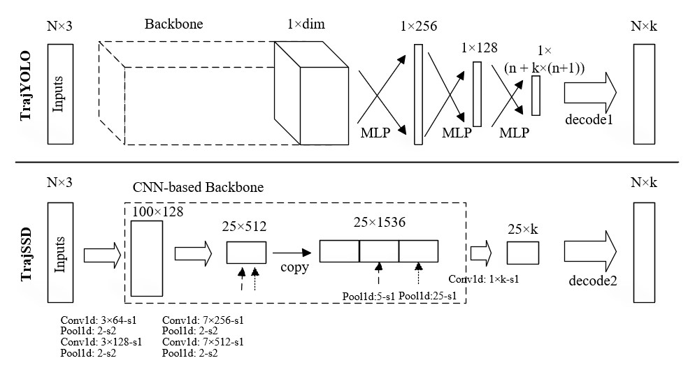

## TrajYOLO and TrajSSD for change point detection and segment classification

### Summary

This is an Python implementation for TrajYOLO and TrajSSD, including data preprocessing, various backbones and some reproduced works. The TrajYOLO and TrajSSD aim to unify  **change point detection** and **segment classification** for **transportation mode identification** using GPS trajectories in a regression task, so as to bring supervisory signal for change point detection, incorporate more contextual info, produce continuous predictions and optimize the entire process effectively.  Their schemas are as the following figure.

- **TrajYOLO**: after feature extraction using various backbones, the features are sent to MLP to obtain  coordinates of n change points and class probabilities for n+1 segments across k modes.

- **TrajSSD**: after feature extraction using CNN-based backbones, the convolutional kernels slide over the feature mapping to obtain outputs.



More details will be disclosed once the related paper published. If you find our work useful in your research or have any questions, please contact the author by opening an issue or [e-mail](lirs926535@outlook.com).

### Requirements

```python
python >= 3.7
pytorch >= 1.6.0
numpy >= 1.17.2
pickle
scikit-learn >= 0.21.3
geopy >= 2.1.0
ruptures >= 1.1.7
pgmpy >= 0.1.20
```

### Usage

For reproduction, follow the steps:

- Data preprocessing. 

  - Download the original [GeoLife](https://www.microsoft.com/en-us/download/details.aspx?id=52367) or the manually [corrected version](https://github.com/RadetzkyLi/3P-MSPointNet/blob/master/data/Traj%20Label%20Each%20-%20C.rar). (The latter is recommended for more accurate annotations)

  - Running `data_cleaning.py` , `pre_processing.py` , `DL_data_creation.py` in order. The expected result is a pickle file composed of training, validation and test set.

- Network training. Keep the default config, run `train.py` for training network under TrajYOLO or TrajSSD.

- Evaluation. Using weight from training, run `test.py` to get predictions for test set.

## Citation

If you find our work useful in your research, please consider citing:

```
@article{LI2023unify,
 title={Unify Change Point Detection and Segment Classification in a Regression Task for Transportation Mode Identification}, 
 author={Rongsong Li and Xin Pei},
 year={2023},
 eprint={2312.04821},
 archivePrefix={arXiv},
 primaryClass={cs.CV}
}
```

### License

Our code is released under MIT License (see LICENSE file for details).
